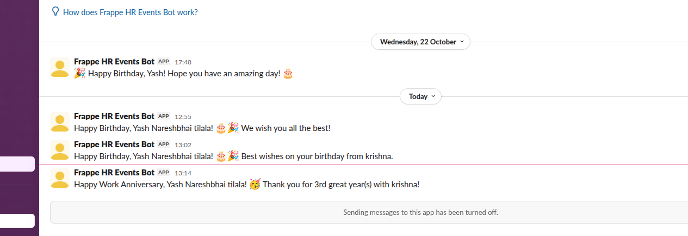

# HR Events Slack Notifier

A Frappe HR app to manage employee events. Automatically sends direct messages on Slack for birthdays and work anniversaries.




## ✨ Key Features

-   **Automated Birthday Wishes**: Automatically sends a "Happy Birthday" message via Slack DM to employees on their birthday.
-   **Automated Anniversary Wishes**: Automatically sends a "Happy Work Anniversary" message via Slack DM, celebrating their years of service.
-   **Easy Setup**: A single settings page to configure your Slack Bot Token.
-   **One-Click User Sync**: A simple "Sync Slack Users" button that maps your Frappe employees to their Slack accounts via their email address.

## 📦 Prerequisites

Before you begin, make sure you have the following apps installed on your Frappe site:

1.  **Frappe HRMS (hrms)**: This app is required for the `Employee` doctype.

## 🚀 Installation

1.  Open your bench terminal and go to your `frappe-bench` directory.
2.  Install the Frappe HRMS app (if you haven't already):
    ```bash
    bench get-app hrms
    bench --site [your-site-name] install-app hrms
    ```
3.  Install this app:
    ```bash
    bench get-app https://github.com/yashtilala412/frappe-hr-events
    bench --site [your-site-name] install-app hr_events
    bench migrate
    bench restart
    ```

## ⚙️ Configuration

1.  **Create your Slack App**:
    -   Go to [api.slack.com/apps](https://api.slack.com/apps) and create a new app.
    -   Go to **"OAuth & Permissions"**.
    -   Add the following **Bot Token Scopes**:
        -   `chat:write` (to send messages)
        -   `users:read` (to find users)
        -   `users:read.email` (to find users by email)
    -   Install the app to your workspace and copy the **"Bot User OAuth Token"** (it starts with `xoxb-`).

2.  **Configure Frappe**:
    -   In your Frappe Desk, go to the **"HR Event Settings"** page.
    -   Paste your **Slack Bot Token** and **Save**.

3.  **Prepare Your Employee Data**:
    -   Go to the **"Employee List"**.
    -   For each employee you want to include:
        -   Make sure their **"Date of Birth"** and **"Date of Joining"** are correct.
        -   Make sure their **"User ID"** field is linked to their Frappe `User` (the user that has their company email).

4.  **Sync Users**:
    -   Go back to **"HR Event Settings"**.
    -   Click the **"Sync Slack Users"** button.
    -   This will run in the background. You can check the **"User Meta List"** to see if your employees' Slack IDs have been fetched.

5.  **You're Done!**
    -   The app will now run a check every day. If it finds an employee with a birthday or work anniversary, it will automatically send them a celebratory DM!

## 🤝 Contributing

This app uses `pre-commit` for code formatting and linting. Please [install pre-commit](https://pre-commit.com/#installation) and enable it for this repository:

```bash
cd apps/hr_events
pre-commit install
